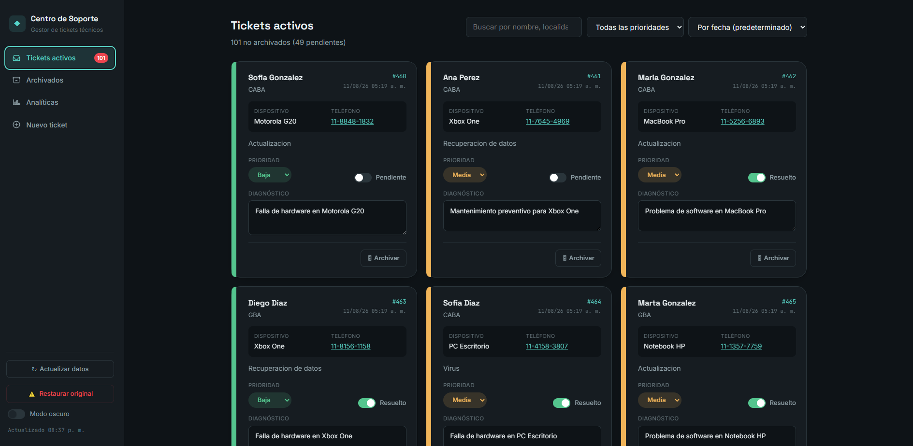
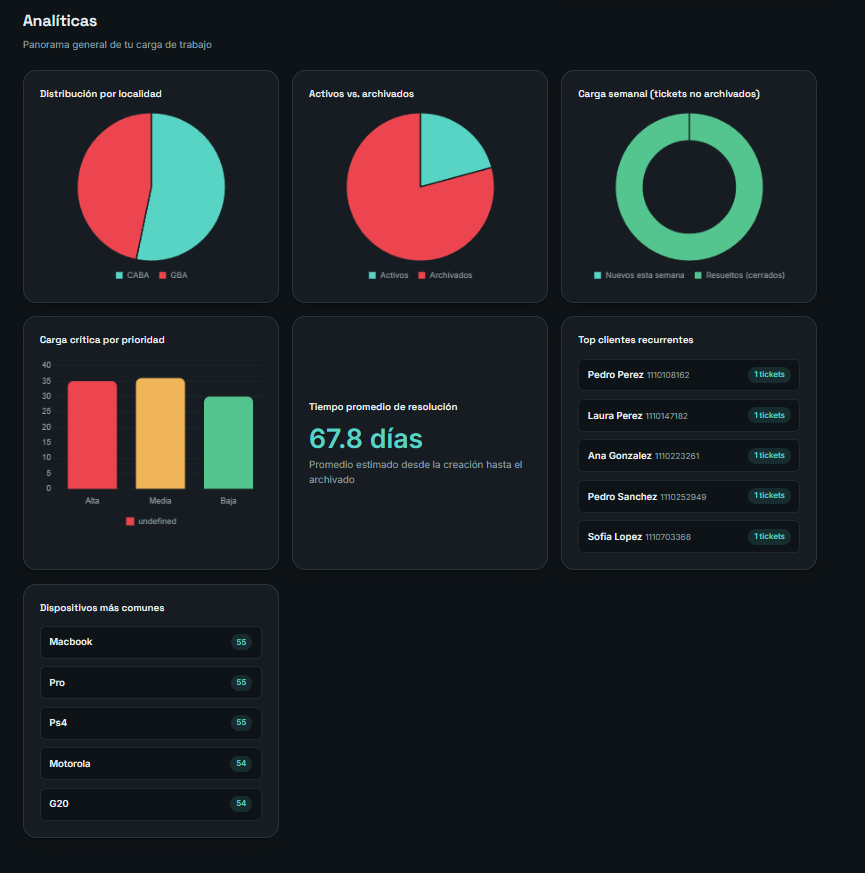
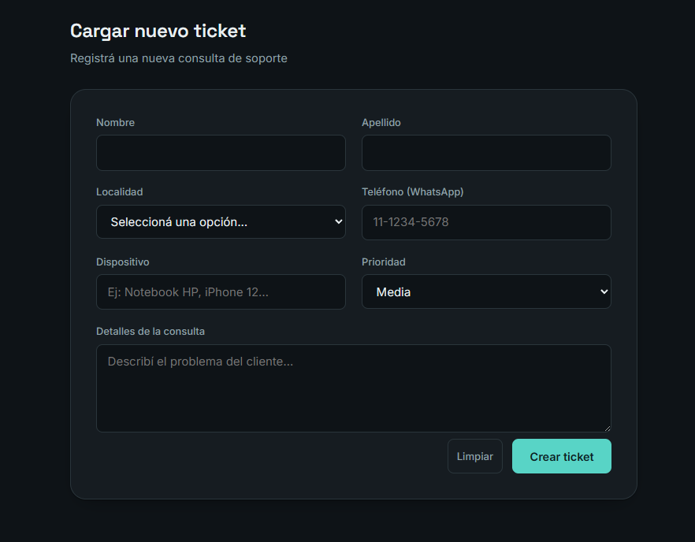
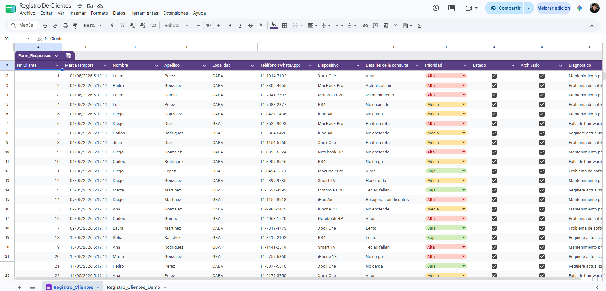
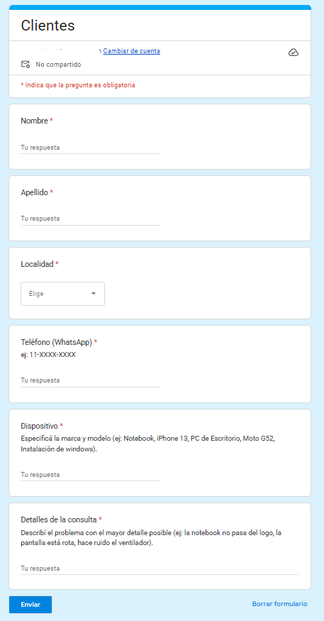

# 🛠️ Centro de Soporte - Gestor de Tickets Técnicos

Un sistema de gestión de clientes y tickets diseñado específicamente para técnicos de soporte freelance. Permite organizar, visualizar y administrar las reparaciones de manera eficiente utilizando herramientas accesibles y gratuitas.

---

## 📝 Descripción

Este proyecto nació de la necesidad de organizar el flujo de trabajo de un técnico independiente. Utiliza **Google Sheets** como base de datos principal, permitiendo el ingreso de solicitudes a través de **Google Forms** (ideal para que los clientes se autogestionen) o directamente desde una interfaz web amigable. La comunicación entre el frontend y la base de datos se realiza a través de una API construida con **Google Apps Script**.

## 📊 Generación del Dataset (Mock Data)

Para simular un entorno de producción real y poder visualizar las métricas en el dashboard analítico desde el primer momento, se construyó un dataset ficticio directamente en Google Sheets. 

En lugar de cargar datos manualmente, se automatizó la creación de los registros utilizando funciones nativas de hojas de cálculo, lo que permitió generar un volumen significativo de tickets con variabilidad realista.

El proceso se llevó a cabo utilizando las siguientes técnicas:

* **Asignación Aleatoria de Categorías:** Se utilizó la combinación de funciones `INDICE` y `ALEATORIO.ENTRE` (o `ELEGIR`) para poblar columnas categóricas. Por ejemplo, para la columna **Dispositivo**, la fórmula seleccionaba aleatoriamente de una lista predefinida (Ej: *MacBook Pro, Notebook HP, Xbox One, PS4*).
* **Distribución de Localidades y Prioridades:** De manera similar, se automatizó la asignación de localidades (CABA, GBA) y niveles de prioridad (Alta, Media, Baja), asegurando una dispersión de datos que alimentara correctamente los gráficos de torta y barras en el frontend.
* **Generación de Fechas:** Se simularon marcas temporales (*timestamps*) realistas para calcular la "Carga semanal" y el "Tiempo promedio de resolución", sumando o restando días aleatorios a una fecha base.
* **Simulación de Clientes Recurrentes:** Para probar la métrica de "Top clientes recurrentes", se acotó el rango de nombres, apellidos y números de teléfono generados, forzando intencionalmente que ciertos perfiles aparecieran múltiples veces en el registro.

> **Nota:** Una vez generados todos los datos dinámicos, se pegaron como "Solo valores" para congelar el dataset, evitar recálculos constantes en la hoja y asegurar que la conexión con la API de Google Apps Script fuera rápida y estable.

## ✨ Características Principales

*   **Gestión Integral de Tickets**: Visualiza todos los tickets activos, asigna prioridades (Alta, Media, Baja), añade diagnósticos y marca su estado (Pendiente / Resuelto).
*   **Ingreso Multicanal**:
    *   *Google Forms*: Enlace público para que los clientes registren sus problemas de forma autónoma.
    *   *Panel Web*: Formulario integrado para que el técnico cargue tickets rápidamente sin salir de la plataforma.
*   **Sistema de Archivado**: Limpia tu vista principal archivando los tickets resueltos
*   **Dashboard de Analíticas**: Toma decisiones informadas con gráficos interactivos:
    *   Distribución de clientes por localidad (ej. CABA vs GBA).
    *   Proporción de tickets activos vs. archivados.
    *   Carga semanal de tickets no archivados.
    *   Nivel crítico de carga por prioridad.
    *   Métricas clave: Tiempo promedio de resolución, Top de clientes recurrentes y Dispositivos más comunes.
*   **Modo Demo Integrado**: Incluye una función de "Restaurar original" que permite a los visitantes del repositorio probar la aplicación, modificar datos y revertir los cambios fácilmente.
*   **Modo Oscuro**: Interfaz cuidada con soporte para *dark mode*.

## 💻 Tecnologías Utilizadas

*   **Frontend**: HTML5, CSS3, Vanilla JavaScript.
*   **Backend & API**: Google Apps Script.
*   **Base de Datos**: Google Sheets.
*   **Ingreso de Datos Externo**: Google Forms.

## 📸 Capturas de Pantalla

### Panel de Tickets Activos


### Dashboard de Analíticas


### Carga de Nuevo Ticket


### Base de Datos y Formulario



## 🚀 Instalación y Configuración

1.  Clona este repositorio:
    ```bash
    git clone https://github.com/GabrielFndz01/GestorDeClientes.git
    ```
2.  Crea un nuevo documento de **Google Sheets** y un **Google Forms** vinculado.
3.  En tu Google Sheets, ve a `Extensiones > Apps Script`. Copia y pega el código de backend (incluido en este repositorio) y despliégalo como una **Aplicación Web** (asegúrate de dar permisos de acceso a "Cualquier persona").
4.  Copia la URL proporcionada por Apps Script.
5.  Reemplaza la URL de la API en el archivo JavaScript de tu frontend con la nueva URL obtenida.
6.  ¡Abre el archivo `index.html` (o súbelo a un hosting gratuito) y comienza a gestionar tus tickets!
